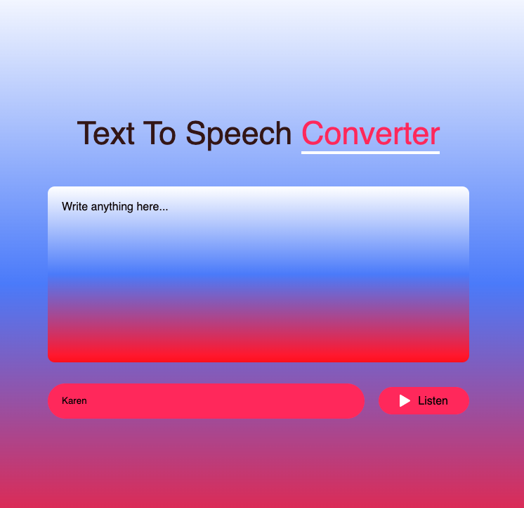

# Speechify

**Speechify** is a simple text-to-speech converter created using **HTML**, **CSS**, and **JavaScript**. The application allows users to input text, and it will be converted into speech using the Web Speech API. It's a great tool for accessibility and a fun way to convert text into speech on your browser.

## Features

- **Text-to-Speech**: Convert any entered text into speech.
- **Customizable Voice Options**: Choose from different voices and control the speech rate.
- **User-Friendly Interface**: Simple and easy-to-use interface to input text and interact with the speech.
- **Real-Time Speech**: Speak the text in real-time as soon as you hit the "Speak" button.




## Installation

Clone the repository:
   ```
   git clone https://github.com/yourusername/Speechify.git
   cd Speechify
   ```
## Usage

Enter Text: Type the text you want to convert to speech in the text box.

Choose a Voice: Select a voice from the available list (if supported by the browser).

Click "Listen": Hit the "Listen" button to hear the text you entered.

## Technologies Used

HTML5: Basic structure of the project.

CSS: Basic styles for layout and design.

JavaScript: The core logic for the text-to-speech conversion using the Web Speech API.

### Live-Demo:

[View a live demo here](https://algomystique.github.io/Converter-Text-to-Speech)

## **License:**

This project is licensed under the MIT License - see the LICENSE file for details.
